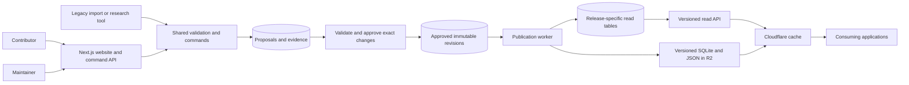
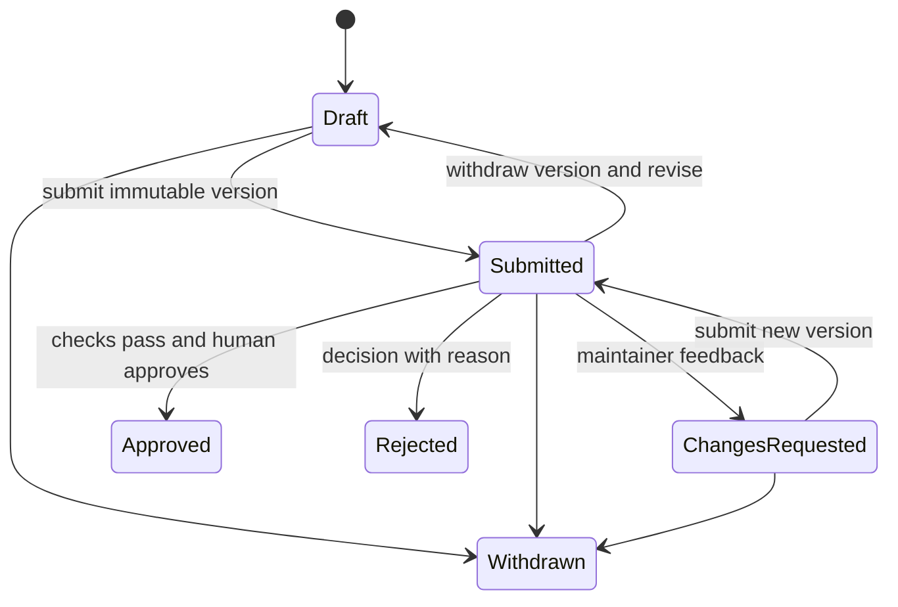

# Boardgame catalog architecture

Status: implementation specification; M1 foundation and M2 local contribution workflow implemented September 19, 2026. Remote CI remains unverified. Written September 18, 2026.

This document describes the next version of the project. The current YAML catalog, SQLite builder, and Express application remain the authoritative production path. Shared contracts, storage migrations, authentication, contribution forms, and transactional review now exist alongside it; this work does not migrate or publish real catalog data. See the [development guide](development.md), [editorial API](editorial-api.md), and [session handoff](session-handoff.md) for implemented scope and verification limits. M3 and later milestones remain planned.

## 1. Purpose and first release

Create a dependable boardgame catalog that several applications can consume, and that boardgame users can improve through simple web forms. Corrections and additions require human review before publication. Read traffic is currently unknown, and approved data is expected to change relatively infrequently.

The first milestone is approximately **50 reviewed game records**, their associated editions and references, a working contribution/review workflow, a versioned read API, and SQLite/JSON downloads. One consuming application must demonstrate a real query and adopt a corrected release.

### Decisions

| Area | Decision |
| --- | --- |
| Application | TypeScript and Next.js, using the Node.js runtime for database-backed routes |
| Database | Supabase-hosted PostgreSQL as the authoritative store after migration |
| Accounts | Supabase Auth; contributors and maintainers have distinct application permissions |
| Contract validation | Zod schemas shared by forms, server commands, imports, and export builders; PostgreSQL constraints enforce relational integrity |
| Database access | Drizzle for typed queries; version-controlled SQL migrations through the Supabase migration workflow |
| Background work | A worker command in the same codebase, using a durable PostgreSQL job table |
| Delivery | REST API with Cloudflare caching; versioned files and approved images in Cloudflare R2 |
| Offline use | Complete SQLite and JSON snapshots of each published release |
| Code review | GitHub pull requests and CI for code, schema, and contract changes |
| Deployment | One web application and one worker process from the same build, placed near the database; hosting provider chosen during implementation |

Next.js route handlers provide the HTTP surface. Supabase supplies PostgreSQL and authentication; contribution review is functionality this project implements. [Next.js route handlers](https://nextjs.org/docs/app/getting-started/route-handlers), [Supabase database](https://supabase.com/docs/guides/database/overview), [Supabase Auth](https://supabase.com/docs/guides/auth).

PostgreSQL supports the contribution transactions and revision history. SQLite continues as a portable read artifact. Existing YAML becomes an import/export format after cutover; maintaining two writable sources of truth is outside this design.

### Initial scope

- Browsing, game lookup, aliases, editions, expansion relationships, and basic search/filtering.
- Reporting a problem, suggesting a correction, adding a game, and following submission status.
- A maintainer queue, evidence review, discussion, approval, and revision history.
- Controlled publication, release pinning, rollback, and complete catalog downloads.
- Sources and explicit uncertainty for factual fields.

Collections, personal ratings, play logging, prices, inventory, social features, and recommendation algorithms belong to consuming applications. Automatic research can later submit proposals through the same validation gate. Dedicated search infrastructure, Redis, read replicas, incremental export feeds, and sophisticated reputation systems require demonstrated need.

## 2. Architecture and ownership



Proposals, revisions, and published read tables are logical areas of the same PostgreSQL database. They do not require separate database servers or independently deployed services.

Use three internal schemas: `editorial` for identities, proposals, evidence and approved revisions; `catalog` for releases and their read projections; and `operations` for jobs and publication events. Keep these schemas outside the Supabase Data API's exposed schemas. The public application contract is the project's versioned REST API, not the physical database tables.

There are three different moments in the lifecycle:

1. **Submitted:** a contributor requests a change; the catalog is unaffected.
2. **Approved:** a maintainer accepts an exact revision; it is eligible for a future release.
3. **Published:** a complete release containing that revision becomes available to applications.

All public reads, including the website's ordinary game pages, use published data. A maintainer preview explicitly identifies unpublished content and uses private, uncached endpoints.

## 3. Catalog model

### Identity and edition policy

Use opaque UUID strings for entities, revisions, and proposals. Human-readable slugs and alternate names are lookup aids. Changing a title does not change identity, and slugs are never regenerated as primary keys. Preserve the existing filename slug in a reviewed legacy mapping, including titles such as `007`.

| Concept | Meaning and important fields |
| --- | --- |
| Game | A distinct game design: name, localized aliases, first publication year, description, kind, designers, taxonomy, default edition, and relationships |
| Edition | A particular publication of a game: game ID, edition title, publication year, languages, publishers, artists, identifiers, and sourced play specifications |
| Person / organization | Stable identity with a display name and aliases; credited by ID with an explicit role |
| Taxonomy term | A stable term ID, vocabulary (`mechanic`, `theme`, `style`, or an assessment vocabulary), label, definition, and retirement/replacement information |
| Family | A named grouping of related games; membership does not establish edition identity or compatibility |
| Source | An immutable citation: URL, title, publisher/site, source type, access date, and optional page/section locator |
| Assessment | An attributed editorial judgment about a game or edition, including method/rubric version, author, date, and evidence where applicable |

The owner approved this boundary September 19, 2026: translations, reprints, and modest rules updates share a game ID with separate edition IDs. Substantial independently playable redesigns receive a separate game ID connected by `reimplementation_of`. Maintainers resolve ambiguous boundaries using documented reasons. See the [identity decision](decisions/001-catalog-identity.md) for synthetic examples. Never merge entities solely because normalized names match.

`kind` is `base_game`, `expansion`, or `standalone_expansion`. Expansions are game entities with their own editions. `expands` identifies base games an expansion supports; multiple targets mean supported alternatives, not that all targets must be owned together. A non-standalone expansion requires at least one resolved `expands` relationship.

Compatibility belongs to the editions involved when it is edition-specific. The initial relationship vocabulary is `expands`, `reimplementation_of`, and `compatible_with`, with allowed source/target types defined in the contract. Store symmetric compatibility once and derive its inverse. Family membership uses family IDs. Full configurations involving several required/optional expansions are deferred; omit combined play statistics unless their scope can be stated accurately.

The selected default edition is a reviewed choice stored on a game revision. Search results expose its ID alongside any derived player counts, age, or duration. A default edition must belong to the game and exist in the same release. It may be `null` for a reviewed identity with insufficient edition evidence. Consumers can request a different edition explicitly.

### Field semantics

- IDs and external identifiers are strings. Numeric-looking identifiers must remain strings through import, PostgreSQL, JSON, and SQLite.
- External identifiers include namespace, value, and entity scope. Uniqueness is enforced for `(namespace, value)` against an active entity; identity merges retain a resolution path. Existing external IDs do not authorize fetching from a restricted source.
- `first_published_year` belongs to a game; `publication_year` belongs to an edition. Both may be unknown. Support historical years; do not infer a precise year from an approximate date.
- Play specifications belong to an edition and state `standalone` or the supported base-game context. Allow at most one standalone specification per edition in the pilot. Summary player/time/age fields and the initial player/time filters use that standalone specification; if it is missing, those summary fields are `null`. Contextual expansion specifications remain available in edition detail.
- Player support is either `{"kind":"exact","counts":[1,2,3,4]}` or `{"kind":"at_least","min":2}` when a source explicitly specifies an open upper bound. Counts are positive integers, with no special `"12+"` string. Unknown support is `null`.
- Duration is a nullable `{min, max}` object with nullable positive integer bounds in minutes. Do not manufacture an average from a range. Known bounds must satisfy `min <= max`.
- Unknown scalar facts use `null`. Empty arrays mean no recorded assertions; they do not prove the absence of designers, editions, or expansions. Optional field notes distinguish unknown, disputed, and not-applicable facts where useful.
- Mechanics, themes, styles, people, and publishers have separate fields. A taxonomy change goes through review and is part of the release.
- Recommended player counts, complexity, depth, and evokes are attributed assessments. They are optional, carry a rubric/method version, and do not masquerade as publisher facts or community consensus. No requirement to invent five evokes.
- Personal affinity, hotness, owned copies, and plays are excluded from the shared catalog.

### Storage and revision structure

Use relational tables for identity, references, workflow, and release membership, with validated JSONB documents for immutable revision payloads. This avoids copying every domain table for every revision while retaining queryable publication tables. This is a proposed storage design, not a dependency on a generic wiki engine.

| Table/group | Responsibility and invariants |
| --- | --- |
| `editorial.entities` | Stable UUID, entity kind, creation metadata; provisional entities are invisible until included in a release |
| `editorial.revisions` | Entity ID, revision ID, schema version, immutable payload, canonical payload hash, approval ID, timestamps |
| `editorial.revision_references` | Typed references extracted from revision payloads; real foreign keys to entity identities; created in the same transaction as the revision |
| `editorial.approved_heads` | One current approved revision per entity, constrained to a revision belonging to that entity, updated only by the approval command |
| `editorial.identifier_claims` / `import_mappings` | Unique current external-ID claims and durable mappings from legacy source identities to proposed/approved game and edition IDs; changed by reviewed commands |
| `editorial.sources` / `revision_evidence` | Immutable citations and their links to revision field paths; correcting a citation creates a new citation |
| `editorial.proposals` / `proposal_versions` / `proposal_targets` | Workflow state, author, immutable submitted versions, proposed payloads, and each target's base revision |
| `editorial.validation_runs` / `reviews` / `comments` | Checks tied to exact proposal version and validator version; decisions, explanations, and conversation history |
| `editorial.contributions` | Immutable plain-text intake for games, corrections, and problems, with maintainer archive/reopen status |
| `editorial.reports` | Earlier structured problem reports, retained for compatibility |
| `catalog.releases` / `release_members` | Release metadata and exact entity-to-revision membership; one revision per entity per release |
| `catalog.games` / `editions` / lookup tables | Generated, release-keyed projections for reads, filtering, aliases, taxonomy, external IDs, redirects, and relationships |
| `catalog.current_release` | One authoritative pointer with an activation generation incremented on every activation or rollback |
| `operations.jobs` / `publication_events` | Durable work, attempts, leases, errors, and activation/rollback history |

Foreign keys, unique constraints, and checks enforce table-level invariants. Application validators enforce payload shapes, reference types, evidence requirements, and domain rules. Write a revision, its references, its evidence links, and its approved-head change in one transaction. CI verifies that derived references match payloads. Use reviewed SQL migrations, and index the foreign-key and filter columns used by actual queries. [PostgreSQL constraints](https://www.postgresql.org/docs/current/ddl-constraints.html).

Every public value, including a designer's displayed name, taxonomy label, redirect, source citation, and public author attribution, must resolve from that release's immutable membership or snapshotted public metadata. Never join a pinned release to mutable editorial display data. Versioned readers can upcast old internal payloads when building a new release; historical revisions and ready release documents are not rewritten.

Merging duplicates creates a reviewed tombstone containing the surviving entity ID, updates affected references in the same proposal, and preserves both historical IDs. New releases resolve the old ID through a release-specific redirect. Previous releases retain their original records. Redirect cycles and redirects to missing entities are invalid.

## 4. Contribution and quality control

### Contributor experience

The site offers three actions with one required field each:

- **Add a game:** provide a name and send it immediately.
- **Suggest a correction:** write what should change, in ordinary language.
- **Report a problem:** write what went wrong; a solution is not required.

**+ Add more information** offers optional plain-text categories: general notes,
links/sources, edition/version, players/time/age, designer/publisher, and other
information. Contributions can be incomplete, uncertain, or low quality. Preserve
what was supplied without inventing facts or requiring bibliography fields. There
is no draft-then-submit step for this intake. Accounts are required to submit.

Raw intake is stored separately from typed catalog proposals. Maintainers can
archive unhelpful or handled input, reopen it, or use it to prepare a catalog
change. The detailed editor and evidence requirements belong to that preparation
and approval process. A future parser can consume the saved raw text; automated
parsing and enrichment are not implemented. Neither receiving nor archiving a
contribution changes an approved record.

Contributors can follow received/archived status in their own contribution list.
Structured proposals retain version history, discussion and decision reasons.
Public browsing/read APIs and outbound notifications remain later milestones.

### State machine

This state machine applies to prepared catalog proposals. Raw contributions have
the simpler received/archived lifecycle described above.



Authors can save drafts and revise changes-requested proposals. Submitted versions are immutable. Revising a submission under review withdraws that version from consideration and creates a new draft version; previous validation results and decisions cannot authorize it. Rejected/withdrawn proposals can be copied into a new proposal with attribution.

Approval is terminal for a proposal. Publication membership is tracked separately: an approved revision can be pending publication, included in a release, or superseded by a later approved revision before publication. A mistaken approval is corrected by a new reviewed proposal. Nothing silently edits an approved or published revision.

### Review gate

The reviewer sees the exact before/after values, edition context, source links and locators, duplicate candidates, validation failures/warnings, and discussion. Factual changes require field-linked evidence. Editorial classification requires attribution and a reason. A URL's presence or accessibility alone is not proof that it supports a claim.

Minimum automated checks:

- Contract types, required identity fields, supported vocabulary, and unknown-field rejection.
- Stable identifier format, external identifier uniqueness, and likely duplicate warnings.
- Player/time/age consistency; edition ownership; legal relationship types; resolved references.
- Required sources for changed facts, with explicit uncertainty where a fact cannot be established.
- Assessment method/rubric references and separation from objective specifications.
- Source-domain policy and asset provenance metadata where assets are involved.
- Proposal base versions, target existence, merge cycles, and the consequences for dependent records.

Checks produce blocking failures or reviewable warnings. A reviewer can explain a warning; a failed structural check must be fixed. Link-check failures are generally warnings because temporary network failures do not invalidate existing evidence. Researchers and AI tools can submit proposals but have no approval or publication authority.

### Approval transaction and conflicts

1. Verify the authenticated session and current maintainer membership on the server.
2. Validate the immutable proposal version against the current contract and approved catalog. Record the revision IDs of dependencies used by validation, including edition ownership and merge targets.
3. In a short transaction, lock stable entity rows for targets and validated dependencies in deterministic order, including newly created targets. Verify every `base_revision_id` and dependency revision still matches the approved heads. For a new target, require that it has no approved head. Lock the proposal state too.
4. Recheck transaction-sensitive uniqueness and reference invariants. A conflict returns `409`; rerun validation and require review of any changed proposal or dependency context. Never silently apply a stale proposal.
5. Record the approval with the proposal version/hash and validator version; append all new revisions, evidence, and references; update approved heads; mark the proposal approved. Commit all changes together.

Network research, link fetching, and export building happen outside that transaction. Approval and publication requests use idempotency keys scoped to actor and command so a retried click cannot produce duplicate decisions or releases. Reusing a key with different request content returns `409`.

Initially the owner is the only maintainer and can review their own manually authored proposal, recorded as self-review. Other contributors require maintainer approval. AI output always requires an explicit human decision. A separate reviewer requirement can be added when there is a second maintainer.

### Permissions and audit

| Actor | Allowed operations |
| --- | --- |
| Visitor / consuming app | Read published records, public history, manifests, and downloads |
| Contributor | Create reports/proposals; edit their own eligible drafts; view/comment on their submissions |
| Maintainer | Review all submissions; request changes; approve/reject; request publication and rollback |
| Publisher worker | Process authorized publication jobs; build release projections/artifacts; activate verified releases |

Use Supabase Auth to establish identity, then check ownership and application role for every editorial operation. Store maintainer membership in server-controlled data; do not authorize from user-editable metadata. Recheck current membership for approval/publishing rather than relying on a stale role claim.

Catalog reads use a database role limited to published data. Editorial and publisher credentials remain server-side and have separate privileges. Browser roles receive no direct grants to internal tables or approval functions. With direct pooled SQL, do not assume an ORM automatically installs the user's JWT context or applies user-specific RLS. Enforce ownership in server commands and keep internal schemas unexposed; use explicit grants and RLS for any intentionally exposed objects. [Supabase API security](https://supabase.com/docs/guides/api/securing-your-api).

Public history includes accepted changes, attribution by chosen display name, sources, and publication dates. Email addresses, private discussion, raw research cache contents, and authentication details are excluded. Render descriptions and comments as escaped text or sanitized limited Markdown. Cookie-authenticated mutations require same-origin/CSRF protection. Rate-limit submissions and oversized requests. Source fetching, if enabled, runs in the worker with redirect, private-network, timeout, and size restrictions.

## 5. Publication and recovery

Publication is an explicit maintainer action in the pilot. Later scheduling can call the same command. Use monotonically allocated release labels such as `r000001`; schema/API versions are separate. Readers never infer which release is current by taking the largest label.

Release build states are `building`, `ready`, or `failed`. A ready release is complete and available to pin, whether or not it is current. Activation is represented by `current_release` and an append-only publication event, not by mutating the release contents. A ready release is immutable.

1. Enqueue a durable publish job with an idempotency key. One publisher runs at a time using a renewable lease; expired attempts can be reclaimed. Job state changes verify a lease token so a worker that lost its lease cannot finalize an attempt.
2. Freeze the complete approved-head membership and schema/exporter version in a short consistent transaction. Later approvals wait for the next release; retries reuse the frozen membership.
3. Validate the complete candidate graph, including editions, references, evidence, redirects, external-ID uniqueness, and default editions. A partial candidate is never publishable.
4. Build release-specific PostgreSQL projections, canonical public documents, and deterministic SQLite/JSON exports from exactly that membership. Snapshot public history from previously published revisions and the candidate's included revisions; unpublished review discussion is excluded. Use stable ordering and serialization; store artifact hashes and byte sizes. Retries reuse verified artifacts or write new attempt paths, never overwrite ready artifacts.
5. Upload artifacts under release-specific paths and verify their existence, hashes, counts, contract compatibility, SQLite integrity, and representative query parity. Record a manifest containing their exact locations.
6. Mark the release ready, then atomically switch `current_release` using the activation generation captured at job start; increment that generation and record the activation event. A stale worker cannot overwrite a newer activation or rollback, even if a rollback has returned the pointer to the same release ID.
7. Purge/revalidate the short-lived current-release response. Cache expiry is the fallback if invalidation fails. Mark the job complete; an interrupted retry detects the recorded activation and completes idempotently.

A publish failure leaves the current release unchanged and records a retryable error. Partially built projections cannot be queried by public readers. R2 paths are not access control: keep staging artifacts private, and expose downloads only for ready releases through the delivery layer. The public read database role must likewise be limited to ready releases through restricted queries/views or policies.

Rollback switches the pointer to a previous ready release, records who requested it and why, and invalidates the current-release cache. It does not delete revisions or change pinned releases. Publication after rollback is explicit: a maintainer resolves or knowingly includes the newer approved changes before activating another release.

Keep every pilot release available. A retention/withdrawal policy is needed before broad distribution; ordinary corrections use a new release. Any exceptional withdrawal must be visible and invalidate affected caches, not silently replace bytes under an immutable URL. Database backups and object backups are separate concerns; periodically test restoration of both. Snapshots alone cannot restore proposals or review history.

## 6. API and export contract

### Public REST endpoints

| Endpoint | Behavior |
| --- | --- |
| `GET /api/v1/releases/current` | Current release ID, schema version, manifest URL, activation time |
| `GET /api/v1/releases/{release}` | Immutable manifest and artifact metadata for a ready release |
| `GET /api/v1/releases/{release}/games` | Paginated search/filter results |
| `GET /api/v1/releases/{release}/games/{id}` | Game detail, default edition, credits, relationships, assessments, and evidence |
| `GET /api/v1/releases/{release}/editions/{id}` | Edition detail with explicitly scoped play specifications |
| `GET /api/v1/releases/{release}/resolve` | Resolve an exact legacy slug or namespaced external identifier to a canonical entity |
| `GET /api/v1/releases/{release}/taxonomy` | Versioned terms and definitions |
| `GET /api/v1/releases/{release}/games/{id}/history` | Sanitized accepted history up to the requested release |

Clients first obtain a release ID and pin subsequent requests to it. No pagination operation follows a moving `latest` alias. A manifest includes `release_id`, `schema_version`, contract/exporter versions, creation time, counts by entity type, artifact URLs, SHA-256 checksums, byte sizes, and the dataset's distribution metadata.

`v1` identifies the HTTP contract; `schema_version` identifies the exported public data structure; internal revision payloads have their own schema version. A release freezes its serializer and search/filter contract versions. Serving old releases must retain those rules and canonical documents across application deployments. Changed representations require a new release or API version rather than silently changing content at an existing immutable URL.

Use consistent names and types across detail, list, JSON, and SQLite representations. List results are a documented `GameSummary` projection of `GameDetail`; they do not rename `designers` to `designer` or change numeric counts to strings. Details explicitly identify which edition supplied summary specifications. Include `release_id` in every response envelope. An entity's `revision_id` describes its own revision; an aggregate document's ETag hashes the full representation, including related names and edition facts.

Initial query parameters: `q`, `kind`, `players`, `max_playtime`, repeated `mechanic`, repeated `theme`, `sort`, `limit`, and `cursor`. Search includes primary names and aliases, with PostgreSQL full-text/trigram indexes as measured. Default sort is name plus stable ID. Limit defaults to 25 and is capped at 100; query text is capped at 200 characters. Reject unsupported parameters and malformed types with `400`.

`players` matches documented standalone support in the selected default edition. `max_playtime` requires a known maximum duration at or below the requested number; unknown values do not pass that filter. Repeated terms are ANDed within a vocabulary, and filters are ANDed together. Initial sorts are name ascending and first-publication-year descending with unknown years last; each includes ID as a tie-breaker. Cursor tokens bind the release, canonical filters, sort contract, and last sort values. A cursor used with different inputs returns `400`.

Use `404` for absent entities/releases, `409` for editorial version conflicts, `422` for structurally valid editorial requests that fail domain validation, `429` with `Retry-After` for rate limiting, and `503` for unavailable dependencies. Failure must not look like an empty successful catalog. Errors have a stable code, message, optional field errors, and request ID. Known merged IDs return a temporary redirect to the canonical ID within the same pinned release; resolution endpoints also return redirect metadata explicitly.

Example list response, using synthetic data and showing the initial summary contract:

```json
{
  "release_id": "r000001",
  "schema_version": 1,
  "data": [
    {
      "id": "b6d33858-d899-4b62-a753-e34e6fdc7f73",
      "revision_id": "b1ce5b23-7e5a-4a15-a0af-4fa61f768679",
      "name": "Example Grove",
      "kind": "base_game",
      "first_published_year": 2024,
      "designers": [],
      "mechanics": [],
      "themes": [],
      "default_edition": {
        "id": "4bfa4317-438e-4efc-9ac6-c237a276dc56",
        "name": "English edition",
        "publication_year": 2024,
        "player_support": { "kind": "exact", "counts": [1, 2, 3, 4] },
        "playtime_minutes": { "min": 30, "max": 60 },
        "min_age": null
      }
    }
  ],
  "next_cursor": null
}
```

### Editorial endpoints

All editorial endpoints are authenticated, private, and uncached. Separate `/api/editorial/v1` routes cover reports, proposal drafts, draft updates with expected versions, submission, comments, review decisions, and publication requests. Actions such as approve/reject/publish are explicit commands; generic record updates cannot set workflow or publication status. Authorization is checked independently of which UI invoked the endpoint.

The command contract includes an expected proposal version; approval additionally identifies the exact submitted hash. Reports can remain unresolved without being converted into a speculative correction. Maintainers can create a linked proposal once evidence is available.

### Downloads and client use

Each release exports a SQLite file with relational game/edition/credit/taxonomy/relationship tables, public evidence, redirects, and release metadata. A documented view supplies the same summary semantics as the API. Full-text search ranking can differ between SQLite and PostgreSQL; shared field/filter meanings and entity membership must agree.

The JSON artifact contains typed arrays for all published entity kinds, public evidence, redirects, and the same release metadata. Export contracts are versioned alongside the API. User accounts, drafts, review discussion, and raw fetched HTML never appear in either export.

An application can poll the current manifest, download a changed snapshot, verify its checksum/schema/integrity, and replace its local copy atomically. Keep personal data in a separate database or tables keyed by catalog IDs; an update must not overwrite collections or play history. If an update fails, the client continues using its prior valid snapshot. Clients must follow merge redirects when resolving stored catalog IDs.

## 7. Caching, deployment, and operations

| Response | Initial policy |
| --- | --- |
| Current release | `public, max-age=0, s-maxage=60, must-revalidate`; ETag and explicit invalidation on activation/rollback |
| Pinned game, edition, taxonomy, history, manifest | `public, max-age=86400, s-maxage=31536000, immutable`; ETag |
| Pinned search/list | `public, max-age=300, s-maxage=3600`; ETag; bounded query vocabulary |
| Versioned exports and approved image assets | `public, max-age=31536000, immutable`; checksums/content-based filenames |
| Editorial/authenticated/private response | `private, no-store`; CDN bypass |
| Error or unready release | `no-store` initially, avoiding stale negative lookups during publication |

These are proposed starting values, not measured service guarantees. A longer TTL does not guarantee cache residency. Publication visibility for online clients using the current endpoint targets 60 seconds after successful activation under normal operation; offline clients update on their own schedule. Corrections cannot alter a deliberately pinned older release.

Configure Cloudflare explicitly for public JSON endpoints; JSON is not cached by default. Cache keys include the API version, release, route, every result-affecting query parameter, and representation. Normalize repeated-term ordering, query encoding, and defaults before caching; do not ignore query strings. Reject unknown input before populating the cache. An optional small Worker can perform canonicalization if Cache Rules alone are insufficient. [Cloudflare cache behavior](https://developers.cloudflare.com/cache/concepts/default-cache-behavior/).

Public catalog endpoints return identical data regardless of login and never set session cookies. Editorial routes have separate cache rules. Browser clients use the public API without credentials; CORS permits public GET access, while mutations remain same-origin. R2 exports use a custom delivery domain and explicitly configured caching; staging data remains private. [R2 public delivery](https://developers.cloudflare.com/r2/buckets/public-buckets/).

The Node application uses bounded connection pools sized against the database connection budget. Choose Supabase pooler mode and driver settings to match the deployment; do not create a new unbounded pool per request or assume transaction pooling supports session state. The worker runs independently of request lifetimes and retries durable jobs with capped backoff. [Supabase connection guidance](https://supabase.com/docs/guides/database/connecting-to-postgres).

Monitor requests by endpoint, latency percentiles, errors, cache hits/misses, origin query volume, slow queries, database connections, job age/failure counts, publication duration, and review queue age. Non-secret client identifiers may attribute use by the owner's apps; they are analytics labels, not credentials. Deployment secrets and credentials stay outside repository data and artifacts.

Before calling the pilot ready, run a reproducible load test at proposed initial targets of 20 origin requests/second for five minutes and 200 cached requests/second for five minutes. Mix detail reads, pagination, and low-reuse searches, and exercise a publication during reads. Record dataset size, concurrency, region, cache state, p50/p95/p99, errors, and database load. Aim initially for p95 origin reads below 500 ms and warm-cache reads below 200 ms from the chosen test region, with no incorrect responses or unexpected server errors. These are acceptance targets to validate and revise, not claims of existing capacity.

## 8. Migration and pilot dataset

Treat existing records as candidate data. A clean parse or the presence of an existing YAML file does not establish factual approval.

1. Preserve the existing catalog and its source history. Build a repeatable importer that produces proposals and a mapping from legacy filename slug to proposed entity IDs. Fix ID coercion using filenames plus explicit review, not an assumed numeric value.
2. Select approximately 50 game-level entries and the editions/references needed to describe them. Include numeric titles, localized aliases, multiple editions, ordinary and standalone expansions, a duplicate merge, and unknown/disputed metadata. Include games from the intended consuming application's actual use case.
3. Split old category strings into taxonomy and credits. Map publisher/designer names to reviewed identities. Keep unmapped terms in import reports until classified.
4. Distinguish edition year from original publication year. Convert player counts to typed support and playtime to sourced bounds. Retain ambiguous facts as unknown; do not automatically infer values.
5. Map expansion/family links through the reviewed legacy mapping. Related entities must be included in the pilot or the proposed relationship must remain unpublished; a dangling reference cannot enter a release.
6. Recover usable source citations from the existing malformed research log/cache without treating those records as complete evidence. Review pilot facts against allowed sources. Preserve the existing restriction on researching BoardGameGeek; legacy external IDs can be retained without fetching that site.
7. Keep personal ratings/history out of public imports. Existing editorial assessments require attribution and a documented rubric before publication.
8. Publish only assets with recorded source and distribution permission metadata. Games without approved images use a placeholder; image availability does not block the catalog pilot. The current image directory is not automatically a publishable asset collection.
9. Import into a local/staging database, manually approve the pilot, publish a staging release, and compare it with the legacy data. Import idempotency uses source file/hash plus the preserved mapping; changed input creates a new proposal version, never an overwrite of approved data.

After the pilot succeeds, cut over one consuming application and explicitly make PostgreSQL authoritative. Retire direct-write research scripts for the new catalog; future imports submit proposals. Keep the legacy application/data available during the transition, with an explicit last-imported commit/hash rather than ongoing bidirectional synchronization.

## 9. Implementation sequence and acceptance

| Milestone | Deliverable | Exit condition |
| --- | --- | --- |
| M1: contracts and local storage | Shared schemas, identity/edition rules, SQL migrations, local Supabase setup, fixtures | Numeric IDs survive; references and unknown values have unambiguous behavior; migration and contract checks pass |
| M2: contributions and review | Auth, forms, reports, proposal versions, maintainer queue, transactional approval | Contributor cannot publish; stale proposals conflict; new versions invalidate prior checks; multi-entity approval is atomic |
| M3: pilot import | About 50 reviewed games with editions, evidence, aliases, and relationships | Re-running import makes no duplicate identities; no unresolved published links; facts have evidence or remain unknown |
| M4: publishing and consumption | Durable worker, release projections, manifest, API, SQLite/JSON exports, basic caching | One application pins a release and uses both API and snapshot; artifact membership and values agree |
| M5: correction and recovery | Complete feedback loop, monitoring, load and recovery checks | A sourced correction is reviewed and published; old pins remain stable; failed builds and rollback behave as specified |

The first working demonstration changes a supported player count through a sourced proposal, then shows the correction reaching an app after it selects the new release. Also demonstrate rejection, conflicting edits, an interrupted publication, and pointer rollback. A fixed older release must return the original values throughout.

Meaningful automated coverage includes:

- Domain fixtures for identity, editions, player support, unknowns, aliases, taxonomy, and merges.
- Permission tests against direct HTTP requests and forbidden database access, not just hidden UI buttons.
- Concurrent approval and stale-base conflicts; idempotent retries; approval tied to exact content.
- Publication interruption before and after artifact upload/activation; no partial-release visibility.
- Read-contract and export parity, including release-specific names, citations, and redirects.
- Cache key separation for different filters/releases and cache bypass for private routes.
- Backup restore of editorial data and release artifacts; client update failure retains the previous snapshot.

Pin dependency versions, commit lockfiles, generate a checked OpenAPI artifact from the shared contracts, and run type checking, contract tests, migration checks, and integration tests in CI. Use the local Supabase environment for permission and transaction tests. HTTP and TypeScript contracts require explicit compatibility review when changed.

### Proposed code organization

```text
apps/catalog/           # Next.js pages and thin HTTP route handlers
packages/contracts/    # Zod schemas, public DTOs, OpenAPI generation
packages/domain/       # validation, proposal/review commands, authorization
packages/database/     # typed query definitions and repositories
packages/publishing/   # release builder and SQLite/JSON exporters
workers/catalog/       # durable import/publication job runner
supabase/migrations/   # authoritative SQL migration history
tools/import-legacy/   # repeatable YAML/CSV import and mapping reports
tests/fixtures/        # synthetic edge cases and representative catalog data
docs/                  # architecture, API, editorial policy, runbooks
```

These are boundaries within one repository and deployment build. A route handler or importer calls the same domain commands; it does not create an alternative path around review.

## 10. Decisions to close during implementation

The defaults above are sufficient to begin M1. Record any changes to them as short architecture decisions in this directory.

| Decision | Proposed default / when needed |
| --- | --- |
| First consuming application and priority queries | Select before finalizing the pilot records and M4 integration |
| Dataset license and contributor terms | Specify before public redistribution; keep the pilot private if unresolved |
| Public read access | Public, identical approved data with no per-user personalization; validate this default before deployment |
| Application host, domain, and budget | Choose for Node.js + worker support and proximity to Supabase before deployment |
| Editorial rubrics | Define against pilot examples in M3; defer disputed assessments. The game/edition boundary was approved September 19, 2026. |
| Review volume and second maintainer | Measure queue age; introduce independent review rules when staffing permits |
| Release retention and exceptional withdrawals | Retain all pilot releases; define broader policy before external adoption |

Current vendor references were checked September 18, 2026. Provider behavior and plan limits should be rechecked when implementing deployment; the correctness requirements in this specification do not depend on a particular free tier.
